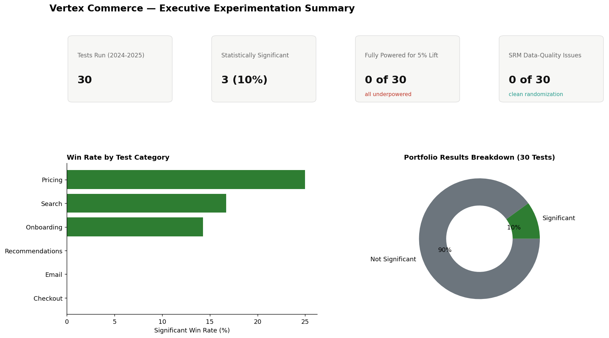
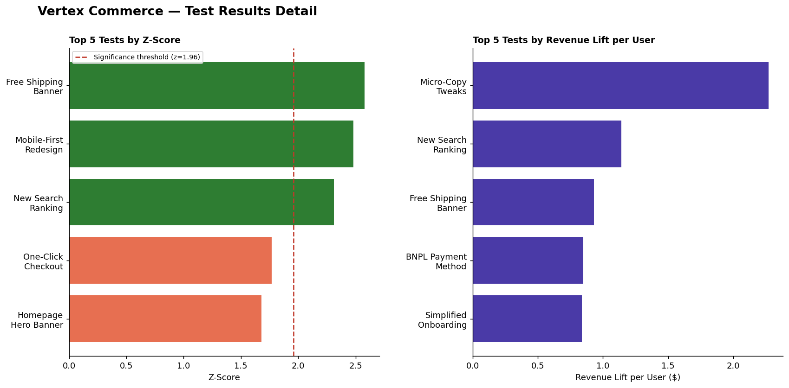
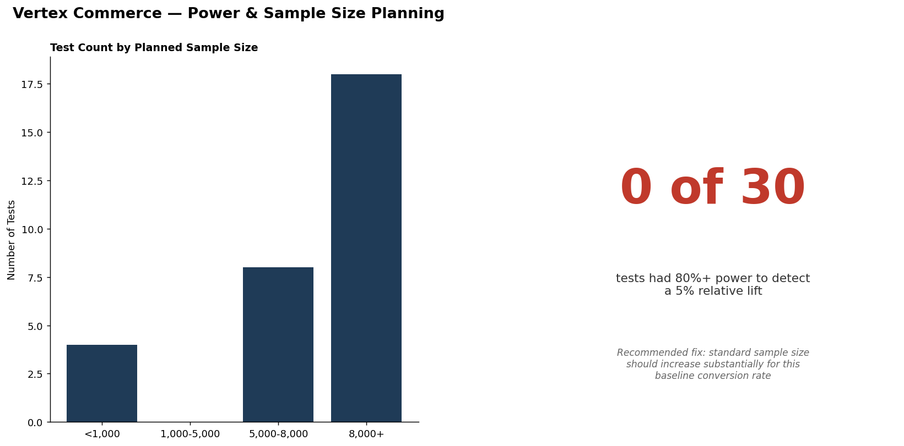
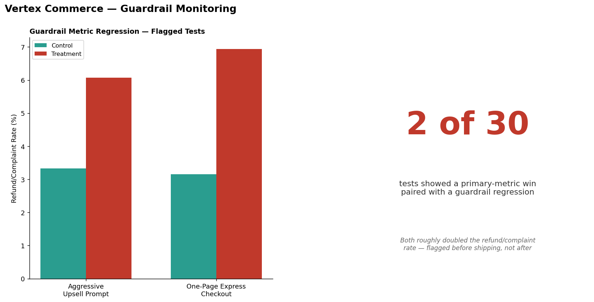

# Vertex Commerce — A/B Testing & Experimentation Analytics


## Research Question

Vertex Commerce runs dozens of A/B tests per quarter across checkout,
pricing, onboarding, search, email, and recommendations. This project asks
a question one level above any individual test: is the experimentation
program itself statistically sound? Specifically — are tests adequately
powered, are secondary (guardrail) metrics being evaluated alongside
primary outcomes, and do the portfolio's aggregate results hold up under
formal scrutiny?

## Data & Methodology

This dataset is synthetic, and deliberately so: the true underlying effect
of each of the 30 experiments was programmed in advance, allowing every
statistical claim in this analysis to be checked against a known ground
truth rather than accepted at face value. This is methodologically
necessary — raw, user-level, multi-experiment data is not published by
companies — and it is disclosed here rather than obscured. The dataset
comprises 30 experiments and 433,900 user-level observations (2024-2025),
with several well-documented experimentation pitfalls deliberately embedded:
underpowered sample sizes, true null effects, novelty-effect decay, segment-
level heterogeneity, and guardrail-metric regressions.

## Executive Experimentation Summary



## Test Results Detail



## Power & Sample Size Planning



## Guardrail Monitoring



## Findings

1. **All 30 of 30 tests were statistically underpowered** to detect a 5%
   relative lift, including tests with 7,000-9,500 users per arm that would
   appear adequately sized under informal review. This is the principal
   finding of the analysis.
2. **Only 3 of 30 tests (10%) reached conventional statistical
   significance (α=0.05)** — a result largely attributable to the
   underpowering above, rather than to the underlying hypotheses being
   unfounded.
3. **No sample ratio mismatch (SRM) was detected across any of the 30
   tests**, indicating the randomization mechanism itself is functioning
   correctly.
4. **Two tests exhibited a statistically favorable primary-metric result
   alongside a guardrail-metric regression** — in both cases, the
   refund/complaint rate approximately doubled in the treatment condition.
5. **The single largest revenue-lift estimate in the portfolio ($2.27 per
   user) was associated with a non-significant result** (n=600 per arm),
   illustrating how a primary-metric-only evaluation could discard a
   genuinely promising finding due to insufficient statistical power rather
   than an absence of effect.

*(The complete set of findings — 15 insights, 10 risks, 15
recommendations, 10 near-term actions, and 10 longer-term opportunities —
is documented in [`docs/business_insights.md`](docs/business_insights.md).)*

## Principal Recommendations

1. Establish a minimum sample size requirement derived from formal
   statistical power calculations, rather than informal convention.
2. Institute a mandatory guardrail-metric review as a precondition for
   shipping any test result.
3. Re-test "Micro-Copy Tweaks on CTA" at an adequately powered sample
   size, given its status as the portfolio's most promising yet least
   conclusively evaluated result.

## Excel Dashboard


Pivot-style summaries, conditional formatting, and VLOOKUP/INDEX-MATCH
lookups are documented in
[`Excel/vertex_experiments_dashboard.xlsx`](Excel/vertex_experiments_dashboard.xlsx).

## Limitations

A complete discussion appears in
[`docs/business_insights.md`](docs/business_insights.md); the principal
limitations are summarized here:

- The dataset is synthetic by design, constructed specifically to allow
  verification of statistical findings against known ground truth.
- No correction for multiple comparisons was applied across the 30
  simultaneous tests. Under a fully null portfolio, approximately 1-2
  significant results would be expected by chance alone at α=0.05; the
  3 significant results observed here should therefore be interpreted with
  appropriate caution rather than treated as unambiguous evidence of
  effectiveness.
- The well-documented "peeking problem" — in which early stopping upon
  observing apparent significance inflates the true false-positive rate —
  is discussed conceptually but not directly modeled or corrected for in
  this version of the analysis.

## Project Structure

| Directory | Contents |
|---|---|
| [`SQL/`](SQL) | Schema and 10 analytical queries, including a two-proportion z-test and sample ratio mismatch check computed directly in SQL |
| [`notebooks/`](notebooks) | Formal hypothesis testing, statistical power analysis, novelty-decay curve fitting, and portfolio-level p-value meta-analysis |
| [`Excel/`](Excel) | KPI workbook with pivot-style summaries, conditional formatting, and VLOOKUP/INDEX-MATCH lookups |
| [`data/`](data) | Synthetic data generator with programmed ground truth |
| [`docs/`](docs) | Complete findings and recommendations report |

**Representative SQL** (two-proportion z-test computed directly in SQL;
full query in [`SQL/02_analysis_queries.sql`](SQL/02_analysis_queries.sql)):
```sql
(p2-p1) / SQRT(p_pool*(1-p_pool)*(1.0/n1+1.0/n2)) AS z_score
```

## Methods & Tools

SQL (window functions, common table expressions, manually-derived
statistical tests) · Statistical methods (hypothesis testing, power
analysis, meta-analysis) · Excel (pivot-style summaries, conditional
formatting, VLOOKUP/INDEX-MATCH) · Power BI dashboard design ·
experimentation methodology (sample ratio mismatch testing, guardrail
metrics, novelty-effect detection, segment heterogeneity analysis)

---

© 2026 Temaje Zakaria. All rights reserved.
